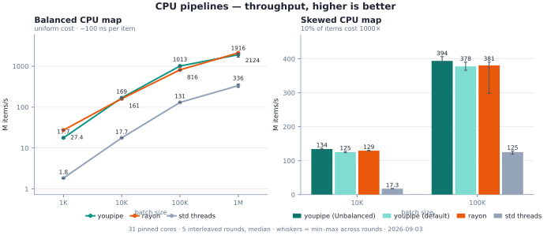
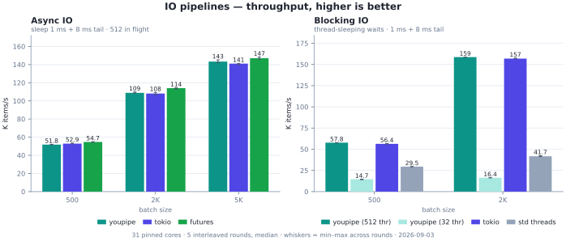
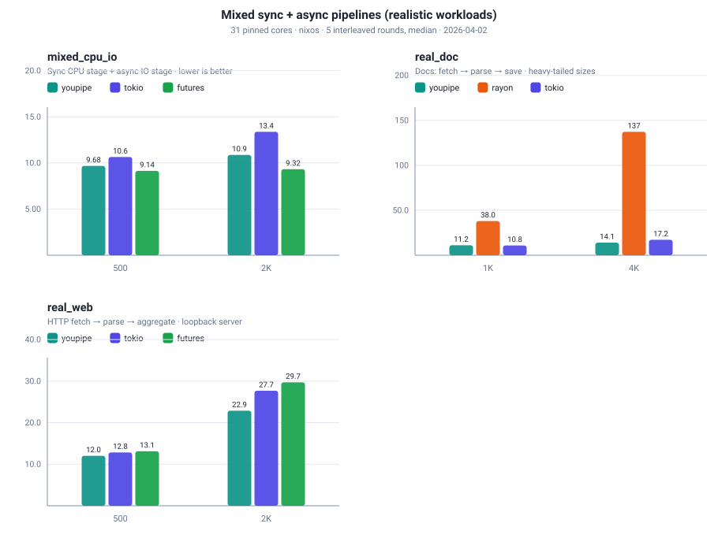

# youpipe

English | [简体中文](./README.zh-CN.md)

youpipe is a high-performance, data-first parallel pipeline supporting mixed
CPU workloads and streaming async IO. Items enter at the front, stages chain
naturally, and a single terminal call (`.collect()` / `.run()`) executes the
whole chain. Two pipeline engines cover different regimes:

- `Pipe` — compile-time fused CPU chains. `.map().filter().map()` becomes a
  single monomorphized closure per worker with no intermediate allocations.
- `StreamPipe` — channel-backed streaming for cases fusion cannot cover:
  async IO, cancellation, fences, 1-to-N expansion, and more.

A rayon-style work-stealing scheduler (`st3` LIFO deque + packed atomic
sleep counters) handles balanced and unbalanced loads. `scope()` supports non-`'static`
closures that borrow stack-local data.

Usage: `cargo add youpipe`.

## API

`pipe(items)` / `items.pipe()` produce the same types — either works.

```rust
use youpipe::pipe;
let r: Vec<i32> = pipe(0..1000).map(|x| x + 1).collect();
// same as
use youpipe::prelude::*;
let r: Vec<i32> = (0..1000).pipe().map(|x| x + 1).collect();
```

Pick the entry point by workload:

| Workload                     | Entry                                                |
| ---------------------------- | ---------------------------------------------------- |
| Pure CPU map/filter          | `pipe(items)`                                        |
| Side-effect only (no output) | `pipe(items).for_each(\|x\| ..)`                     |
| Async IO, mixed sync+async   | `stream(items).stage_async(...)`                     |
| Unbalanced CPU workloads     | `pipe(items).with_workload(Unbalanced)`              |
| Custom split granularity     | `pipe(items).with_workload(Workload::Custom(n))`     |
| Cancellation, fences, expand | `stream(items).with_cancel(..).fence(..).expand(..)` |
| Borrow a slice, no clone     | `pipe_ref(&slice).map(\|&x\| ..)` — rayon `par_iter` counterpart, zero-copy |
| Borrow stack-local data      | `pipe_ref(&data).map(\|x\| ..&local..)` (no scope needed), or `scope(\|s\| s.pipe(items)..)` for non-slice inputs |
| Fallible + borrow            | `pipe_ref(&data).try_map(..).try_collect()`          |

Below ~10 µs of total work or ~100 ns per item, youpipe is not recommended —
the parallel setup overhead won't pay off. Sequential `iter().map().collect()`
is faster in that range.

## Examples

youpipe does **not** wait for one stage to finish completely before starting
the next. Use a fence between stages if you need strict stage isolation.

```rust
use std::num::NonZeroUsize;
use youpipe::prelude::*;

// fused CPU bound
let r: Vec<i32> = (0..1000).pipe()
    .map(|x| x + 1)
    .filter(|x: &i32| x % 2 == 0)
    .map(|x| x * 10)
    .collect();

// fallable
let r: Result<Vec<String>, _> = (0..100).pipe()
    .try_map(|x: i32| if x == 50 { Err("bad") } else { Ok(x * 2) })
    .map(|x| format!("{x}"))
    .try_collect();

// sync CPU stage + async IO stage (overlap on separate pools)
let r: Vec<u64> = (0..1000).stream()
    .stage(|x: u64| x + 1)
    .stage_async(|x: u64| async move { fetch(x).await })
    .run();

// fence: batch every 64 items between two adjacent stages
let r: Vec<i32> = (0..1000).stream()
    .stage(|x: i32| x + 1)
    .fence(FenceMode::Chunked(NonZeroUsize::new(64).unwrap()))
    .stage(|x: i32| x * 2)
    .run();

// for_each: side-effect terminal (no output Vec allocated) — the
// counterpart of rayon's par_iter().for_each(). `Fn + Sync`, so use
// atomics/Mutex for accumulation rather than &mut capture.
use std::sync::{Arc, atomic::{AtomicU64, Ordering}};
let total = Arc::new(AtomicU64::new(0));
let t = total.clone();
pipe(0..1000).for_each(move |x: u64| t.fetch_add(x, Ordering::Relaxed));

// scope + pipe(&slice): borrow without cloning — counterpart of rayon's
// slice.par_iter(). One Vec<&T> allocation, zero clones of T.
let files: Vec<String> = (0..50).map(|i| format!("f{i}")).collect();
let chars = Arc::new(AtomicU64::new(0));
let c = chars.clone();
scope(|s| s.pipe(&files).for_each(move |f: &String| {
    c.fetch_add(f.len() as u64, Ordering::Relaxed);
}));

// scope borrows local `factor` and `table`, no clone
let factor = 7;
let table: Vec<String> = (0..100).map(|i| format!("row-{i}")).collect();
let r: Vec<usize> = scope(|s| {
    s.pipe(0..table.len()).map(|i: usize| table[i].len() * factor).collect()
});
```

## Performance

Cross-library comparison against rayon, tokio, `futures::stream`, and
hand-written `std::thread` pipelines: seven workloads (balanced/skewed CPU,
async/blocking IO, mixed sync+async, and two realistic three-stage pipelines,
including HTTP over a loopback mock server). 32-core AMD (Zen) Linux, 31
pinned cores, 5 interleaved rounds per measurement (ABCABC order, median).
CPU rows use each library's idiomatic borrow (`pipe_ref` vs `par_iter`).
Charts show throughput — higher is better; whiskers span the 5 rounds.
Simulated IO is pure sleeps — nothing touches the disk. Methodology and full
data: [docs/benchmarks.md](docs/benchmarks.md#horizontal-cross-library-comparison-2026-09).

<p align="center">
  
</p>
<p align="center">
  
</p>
<p align="center">
  
</p>

Highlights (median wall time, youpipe vs the strongest alternative;
per-iteration time, setup excluded):

- **CPU, balanced (`pipe_ref` vs rayon `par_iter`)** — youpipe wins at
  10K–100K items (−20 % vs rayon at 100K); rayon wins 1K (fixed setup cost,
  ~20 µs) and 1M (its fork-join runs inline on the calling thread; the 1M
  batch is bandwidth-bound). All three are 5–10× faster than hand-rolled
  equal-chunk threading.
- **CPU, skewed (10 % of items cost 1000×)** — `Workload::Unbalanced` +
  work stealing beats rayon at 100K (0.254 vs 0.263 ms) and is 3× faster
  than equal-chunk threading, which strands the slow items in a few
  threads.
- **Async IO (512 in flight, 1/8 ms tail)** — tied with the async baselines:
  ±2 % vs tokio (crossing ahead at ≥2K items), 2–5 % behind the lighter
  `futures::stream` combinator stack. youpipe rides the same tokio runtime.
- **Blocking IO** — with a 512-thread oversubscribed pool youpipe matches
  `spawn_blocking` (8.66 vs 8.87 ms @ 500); at the default 32 threads it is
  wait-bound (34 ms). Blocking stages need oversubscription — see
  [Advanced usage](#advanced-usage).
- **Mixed sync CPU + async IO** — 10.8 vs 13.2 ms @ 2K items (−18 % vs a
  hand-written tokio channel chain); `futures::stream` edges youpipe out by
  running the CPU stage inline on runtime workers.
- **Realistic doc pipeline (fetch → parse → save, heavy-tailed sizes)** —
  14.3 vs 17.1 ms @ 4K docs: −16 % vs hand-written tokio, 9.6× vs rayon
  (whose pool stalls on the blocking IO).
- **Realistic web pipeline (HTTP GET → parse → aggregate)** — 23.0 vs 27.7 ms
  @ 2K requests: −17 % vs tokio, −22 % vs futures.

Reproduce:

```sh
cargo bench --bench horizontal -- --rounds 5
uv run perf/plot-horizontal.py   # JSON → SVG (matplotlib)
```

## Advanced usage

Defaults: `compute_workers = async_workers = available_parallelism`,
`io_concurrency = 128`, `buffer_size = 256`, `Workload::Balanced`. The tokio
runtime is built lazily on first `.run()` and reused for that run; pass a
`TokioPool` to share one across runs.

```rust
use youpipe::prelude::*;

// Unbalanced: ~10% slow items, 1000× cost spread → raises oversplit factor
let r: Vec<_> = (0..5_000).pipe()
    .with_workload(Workload::Unbalanced)
    .map(|x| expensive(x))
    .collect();

// Workload::Custom(n): pin the fork/join oversplit yourself (1 = coarsest,
// 16 = very fine-grained stealing for extreme skew)
let r: Vec<_> = (0..5_000).pipe()
    .with_workload(Workload::Custom(std::num::NonZeroUsize::new(16).unwrap()))
    .map(|x| expensive(x))
    .collect();

// Tuned config + reused runtime
let cfg = PipelineConfig::default()
    .with_compute_workers(16)
    .with_async_workers(8)
    .with_io_concurrency(512)
    .with_buffer_size(1024);
let pool = TokioPool::build_default()?;
let r = items.stream()
    .with_config(cfg)
    .with_async_pool(pool)
    .stage_async(|x| async move { io(x).await })
    .run();

// Per-stage tuning: heavy CPU stage pinned to 8 workers, the async stage to
// 512 concurrent IO tasks with a deep buffer — unset knobs fall back to the
// pipeline-level config.
let r: Vec<_> = items.stream()
    .stage_with(StageOptions::new().workers(8), |x| crunch(x))
    .stage(|x| light(x))
    .stage_async_with(
        StageOptions::new().io_concurrency(512).buffer(1024),
        |x| async move { io(x).await },
    )
    .run();

// Side-effect terminal without materialising the output Vec — plain &mut
// capture works, the drain runs on the calling thread.
let mut total = 0u64;
stream(0..10_000).stage(|x| x * 2).for_each(|x| total += x);

// Cancellation
let token = CancellationToken::new();
let r = (0..10_000).stream()
    .with_cancel(token.clone())
    .stage(|x| expensive(x))
    .run();

// Oversubscribed compute pool for blocking-IO sync stages. NOTE: pools are
// capped at MAX_COMPUTE_WORKERS (511) — larger sizes are silently clamped.
let pool = ComputePool::new(MAX_COMPUTE_WORKERS);
let r = (0..1000).stream()
    .with_compute_pool(pool)
    .stage(|x| blocking_io(x))
    .run();
```

`io_concurrency` is the M:N multiplier — async tasks yield the OS thread
while waiting, so it can be far larger than `async_workers` (the thread
count). Bound it to cap memory. Override it per async stage with
`StageOptions::io_concurrency` (e.g. a network stage at 512, a disk stage
at 16) via `.stage_async_with(opts, f)`; pin sync-stage worker counts with
`StageOptions::workers` via `.stage_with(opts, f)` — explicit worker claims
are deducted from the `compute_workers` budget before the rest is divided
equally across the unpinned stages.

`.fence(mode)` acts on one adjacent stage boundary. `FenceMode::Barrier`
drains upstream fully before downstream starts; `FenceMode::Chunked(k)`
releases every `k` items as they form (the default for mixed CPU/IO).
`.run()` returns results in completion order; append `.ordered()` to restore
input order via a `ReorderBuffer`. `.run()` panics if the tokio runtime
cannot be built; use `.try_run()` to surface that as a `Result`.

Not every config knob applies to every engine: a fused `pipe()` reads only
`compute_workers` and `workload`; `buffer_size` / `async_workers` /
`io_concurrency` are streaming-only. Pool sizes are capped at
`MAX_COMPUTE_WORKERS = 511` (the scheduler's sleep bitmask is 9 bits wide).

## How it works

see [`docs/README.md`](docs/README.md).

## Attribution

The work-stealing scheduler in `crates/youpipe/src/pool/` is adapted from
[rayon-core](https://github.com/rayon-rs/rayon).
