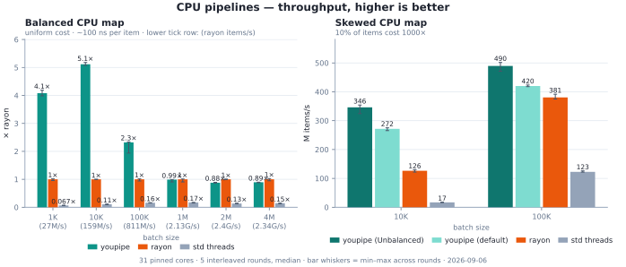
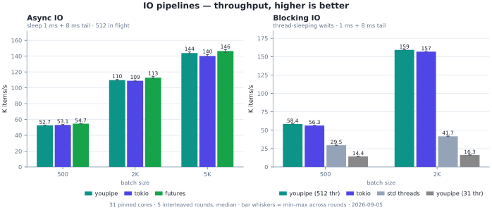
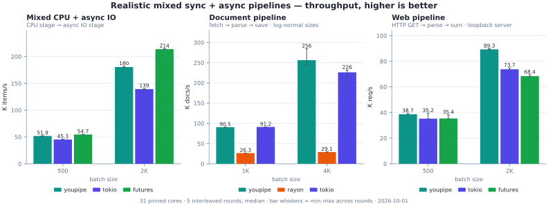

# youpipe

[English](./README.md) | 简体中文

youpipe 是一个高性能、数据优先、支持混合 CPU 负载与流式异步 IO 的并行 pipeline。数据从入口传入，各阶段自然串联，最终通过一次终端调用
（`.collect()` / `.run()`）执行完整链。两种 pipeline 引擎覆盖不同场景：

- `Pipe` — 编译期融合的 CPU 链。`.map().filter().map()` 编译为每个工作线程上单一
  的单态化闭包，不产生任何中间分配。
- `StreamPipe` — 基于通道的流式处理，覆盖融合无法处理的场景：异步 IO、Cancellation、fence、
  一对多展开等。

工作窃取调度器采用 rayon 风格的 `st3` LIFO 双端队列 + 紧凑原子计数器，兼顾均衡与不
均衡负载。`scope()` 支持借用栈上局部数据的非 `'static` 闭包。

使用：`cargo add youpipe`。

## API

`pipe(items)` / `items.pipe()` 产生完全相同的类型，任意选择均可。

```rust
use youpipe::pipe;
let r: Vec<i32> = pipe(0..1000).map(|x| x + 1).collect();
// same as
use youpipe::prelude::*;
let r: Vec<i32> = (0..1000).pipe().map(|x| x + 1).collect();
```

按负载选择入口：

| 负载                      | 入口                                                 |
| ------------------------- | ---------------------------------------------------- |
| 纯 CPU map/filter         | `pipe(items)`                                        |
| 异步 IO、同步+异步混合    | `stream(items).stage_async(...)`                     |
| 非均衡的 CPU 负载         | `pipe(items).with_workload(Unbalanced)`              |
| 自定义拆分粒度            | `pipe(items).with_workload(Workload::Custom(n))`     |
| Cancellation、fence、展开 | `stream(items).with_cancel(..).fence(..).expand(..)` |
| 借用 slice、零拷贝        | `pipe_ref(&slice).map(\|&x\| ..)` —— 对应 rayon `par_iter` |
| 借用栈上局部数据          | `pipe_ref(&data).map(\|x\| ..&local..)`（无需 scope）；非 slice 输入用 `scope(\|s\| s.pipe(items)..)` |
| fallible + 借用           | `pipe_ref(&data).try_map(..).try_collect()`          |

总工作量低于 ~10 µs 或单操作低于 ~100 ns 时，不建议使用 youpipe，并行设置开销无法收回成本。此时使用顺序 `iter().map().collect()` 更快。

## 示例

youpipe **不会**在某一阶段全部完成后，再进入下一阶段。如果需要严格的阶段隔离，需要在 stage 之间使用 fence。

```rust
use std::num::NonZeroUsize;
use youpipe::prelude::*;

// fused CPU bound
let r: Vec<i32> = (0..1000).pipe()
    .map(|x| x + 1)
    .filter(|x: &i32| x % 2 == 0)
    .map(|x| x * 10)
    .collect();

// fallable
let r: Result<Vec<String>, _> = (0..100).pipe()
    .try_map(|x: i32| if x == 50 { Err("bad") } else { Ok(x * 2) })
    .map(|x| format!("{x}"))
    .try_collect();

// 同步 CPU 阶段 + 异步 IO 阶段（在各自线程池上重叠运行）
let r: Vec<u64> = (0..1000).stream()
    .stage(|x: u64| x + 1)
    .stage_async(|x: u64| async move { fetch(x).await })
    .run();

// fence：在两个相邻阶段间每 64 个元素批处理一次
let r: Vec<i32> = (0..1000).stream()
    .stage(|x: i32| x + 1)
    .fence(FenceMode::Chunked(NonZeroUsize::new(64).unwrap()))
    .stage(|x: i32| x * 2)
    .run();

// scope 借用局部 `factor` 和 `table`，无需 clone
let factor = 7;
let table: Vec<String> = (0..100).map(|i| format!("row-{i}")).collect();
let r: Vec<usize> = scope(|s| {
    s.pipe(0..table.len()).map(|i: usize| table[i].len() * factor).collect()
});
```

## 性能

横向库对比（youpipe vs rayon vs tokio vs `futures::stream` vs 手写
`std::thread` pipeline）：七类负载（均衡/倾斜 CPU、异步/阻塞 IO、混合
sync+async，以及两个真实的三阶段 pipeline，含本地 mock server 上的 HTTP）。
32 核 AMD (Zen) Linux，taskset 固定 31 核，每组测量 5 个交叠轮次（ABCABC
顺序，取中位数）。CPU 场景双方都用各自的惯用借用调用（`pipe_ref` vs
`par_iter`）。图表为吞吐量——越高越好；柱状图须线为 5 轮的最小–最大范围。模拟 IO 全部为
sleep，不碰磁盘。方法论与完整数据见
[`docs/src/dev/benchmarks.md`](docs/src/dev/benchmarks.md#horizontal-cross-library-comparison-2026-09)。

<p align="center">
  
</p>
<p align="center">
  
</p>
<p align="center">
  
</p>

要点（中位数耗时；youpipe 对比最强基线；仅计工作负载本身，不含数据准备）：

- **CPU 均衡（`pipe_ref` vs rayon `par_iter`）** —— 10K–100K 区间领先
  （100K 时比 rayon 快 23%）；1K（固定启动开销 ~20 µs）与 1M（rayon 的
  fork-join 内联在调用线程上执行，且该批量已贴内存带宽）由 rayon 领先。
  三方都比手写等分块线程快 5–10×。
- **CPU 倾斜（10% 元素成本 1000×）** —— `Workload::Unbalanced` + work
  stealing 在 100K 时胜过 rayon（0.248 vs 0.260 ms），比等分块手写线程快
  3×（后者会让慢元素搁浅在个别线程）。
- **异步 IO（并发 512，1/8 ms 尾延迟）** —— 与异步基线打平：±1% 对 tokio
  （≥2K 项时反超），落后更轻的 `futures::stream` 组合子栈 2–5%。youpipe
  底层复用同一个 tokio 运行时。
- **阻塞 IO** —— 512 线程过订阅池下 youpipe 与 `spawn_blocking` 打平（500 项
  8.65 vs 8.88 ms）；默认 32 线程时受等待限制（34 ms）。阻塞 stage 需要过订阅
  配置，见[深入用法](#深入用法)。
- **混合 sync CPU + async IO** —— 2K 项 10.8 vs 13.5 ms（比手写 tokio
  channel 链快 20%）；`futures::stream` 略快于 youpipe（CPU 直接内联在
  runtime worker 上执行，没有 stage 边界）。
- **真实文档 pipeline（fetch → parse → save，重尾尺寸）** —— 4K 文档 14.2 vs
  18.4 ms：比手写 tokio 快 23%，比 rayon 快 9.7×（后者的线程池被阻塞 IO 拖死）。
- **真实 web pipeline（HTTP GET → parse → aggregate）** —— 2K 请求 23.0 vs
  27.5 ms：比 tokio 快 16%，比 futures 快 22%。

复现：

```sh
cargo bench -p youpipe --bench horizontal -- --rounds 5
uv run perf/plot-horizontal.py   # JSON → SVG（matplotlib）
```

## 深入用法

默认值：`compute_workers = async_workers = available_parallelism`、
`io_concurrency = 128`、`buffer_size = 256`、`Workload::Balanced`。tokio 运行时在
首次 `.run()` 时延迟构建，并在该次运行内复用；传入 `TokioPool` 可跨运行共享。

```rust
use youpipe::prelude::*;

// 不均衡：约 10% 慢项，成本差距 1000 倍 → 提高过度拆分因子
let r: Vec<_> = (0..5_000).pipe()
    .with_workload(Workload::Unbalanced)
    .map(|x| expensive(x))
    .collect();

// Workload::Custom(n)：自行指定 fork/join 拆分粒度（1 = 最粗，
// 16 = 面向极端偏斜的细粒度窃取）
let r: Vec<_> = (0..5_000).pipe()
    .with_workload(Workload::Custom(std::num::NonZeroUsize::new(16).unwrap()))
    .map(|x| expensive(x))
    .collect();

// 调优配置 + 复用运行时
let cfg = PipelineConfig::default()
    .with_compute_workers(16)
    .with_async_workers(8)
    .with_io_concurrency(512)
    .with_buffer_size(1024);
let pool = TokioPool::build_default()?;
let r = items.stream()
    .with_config(cfg)
    .with_async_pool(pool)
    .stage_async(|x| async move { io(x).await })
    .run();

// 逐阶段调优：重 CPU 阶段固定 8 个 worker，异步阶段固定 512 路 IO 并发 +
// 深缓冲——未设置的旋钮回落到管线级配置。
let r: Vec<_> = items.stream()
    .stage_with(StageOptions::new().workers(8), |x| crunch(x))
    .stage(|x| light(x))
    .stage_async_with(
        StageOptions::new().io_concurrency(512).buffer(1024),
        |x| async move { io(x).await },
    )
    .run();

// 副作用终结器：不物化输出 Vec —— 排空在调用线程上进行，可直接 &mut 捕获。
let mut total = 0u64;
stream(0..10_000).stage(|x| x * 2).for_each(|x| total += x);

// 取消
let token = CancellationToken::new();
let r = (0..10_000).stream()
    .with_cancel(token.clone())
    .stage(|x| expensive(x))
    .run();

// 为阻塞 IO 同步阶段过订阅计算线程池。注意：线程池上限为
// MAX_COMPUTE_WORKERS（511），更大的值会被静默钳制。
let pool = ComputePool::new(MAX_COMPUTE_WORKERS);
let r = (0..1000).stream()
    .with_compute_pool(pool)
    .stage(|x| blocking_io(x))
    .run();
```

`io_concurrency` 是 M:N 乘数——异步任务在等待时会放弃 OS 线程，因此该值可以远大于
`async_workers`（线程数量）。限制此值以控制内存上限。可用
`StageOptions::io_concurrency` 配合 `.stage_async_with(opts, f)` 按阶段覆盖
（例如网络阶段 512、磁盘阶段 16）；`.stage_with(opts, f)` 里的
`StageOptions::workers` 可固定同步阶段的 worker 数——显式 worker 先从
`compute_workers` 预算中扣除，剩余部分再均分给未指定的阶段。

`.fence(mode)` 作用于一个相邻阶段边界。`FenceMode::Barrier` 让上游完全排空后下游
才开始；`FenceMode::Chunked(k)` 每凑齐 `k` 个元素就立即释放（混合 CPU/IO 的推荐
默认）。`.run()` 默认按完成顺序返回结果；追加 `.ordered()` 通过 `ReorderBuffer`
恢复输入顺序。tokio runtime 构建失败会让 `.run()` panic；改用 `.try_run()`
可拿到 `Result`。

并非所有配置项对所有引擎都生效：fused `pipe()` 只读取 `compute_workers` 与
`workload`；`buffer_size` / `async_workers` / `io_concurrency` 仅对流式路径生效。
线程池规模上限为 `MAX_COMPUTE_WORKERS = 511`（调度器休眠位宽为 9 bit）。

## 工作原理

见[开发者指南](docs/src/SUMMARY.md)（mdbook 源码；`mdbook build docs` 构建）。

## 第三方声明

`crates/youpipe/src/pool/` 中的工作窃取调度器改编自
[rayon-core](https://github.com/rayon-rs/rayon)。
